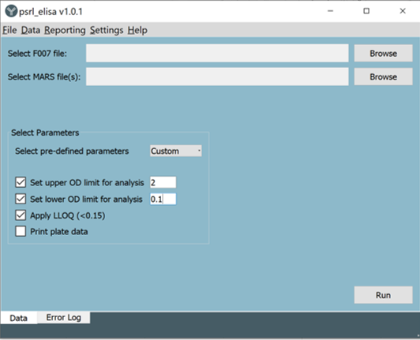

# psrl_elisa

A PyQt5 application to parse and process ELISA data, generating pdf templates and multiple summary files

## About
This application processes ELISA data produced using BMG Labtech's SPECTROstar OMEGA/MARS.
The data input is a .CSV file. A specific template has been applied in MARS and
this application currently only accepts data in this format/layout.

The data processing also takes in a sample file as a .xlsm, again with specific layout and named ranges.

It was created with the lab's SOPs in mind. If you read ELISA plates using BMG Hardware/Software
and would like something similar, get in touch. From a user's perspective it's not particularly customisable,
but should be straightforward enough by editing the code.

## Features

- Automated processing and analysis of multiple ELISA data files
- QC and curve checking
- PDF reports using jinja2 templates
- Summary results table
- QC Trending
- Write to master study file (one generated per study)
- Run details .CSV file containing warnings/assay summary
- Gantt chart plotter  
- QSettings to remember file paths/state of window
- Sentry reporting

## Screenshots
##### Splash screen

##### Main data processing page

## Project files
The directory structure has been set up to make packaging as an executable using the [f-man build system](https://build-system.fman.io/manual/) straightforward. Everything needed for the app to *open/run* is included in the **src/main/resources/base** directory, except [wkhtmltopdf.exe](https://wkhtmltopdf.org/) which is required for [pdfkit](https://pdfkit.org/). This can be downloaded and the executable added to this same directory.

As mentioned above, input and output files follow a specific format according to SOPs, to actually process ELISA data, these would all need to be created or the classes edited to accommodate different formats.

## To-do
* Generalise to accept different input formats
* Make parameters more dynamic (plate layouts, LLOQ etc)

For more information see the [help](https://cdn.rawgit.com/KiFi85/psrl_elisa/master/src/main/resources/base/html/help.html) page
